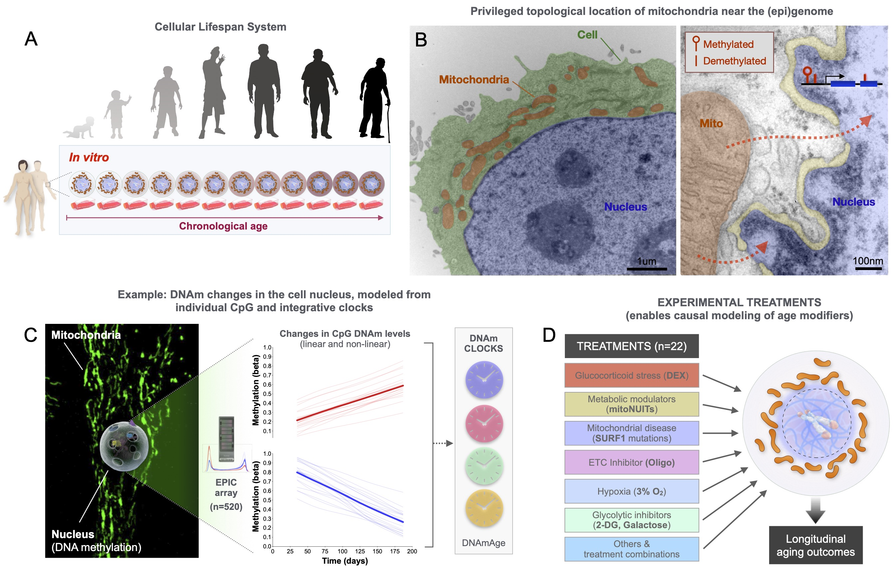
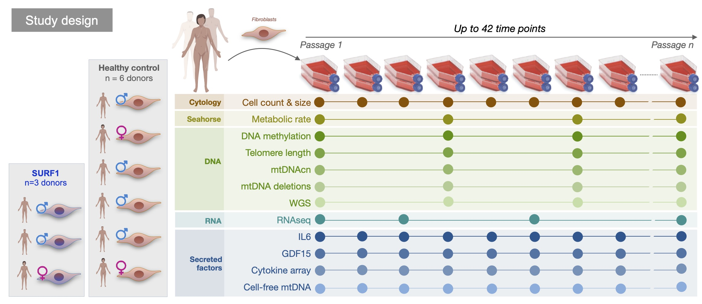
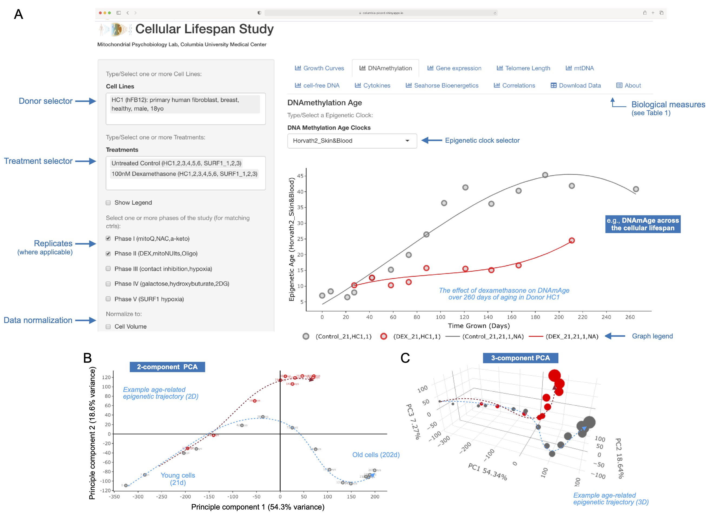

# Cellular_Lifespan_Study
A repository of code for data analysis/processing generated for the Cellular Lifespan Study. 

The study was performed at the Mitochondrial Psychiobiolgy Lab at Columbia University Medical Center. These data contains genome-wide, multimodal data collected at high temporal frequency across the replicative lifespan in cultured primary human fibroblasts. 

All data can be accessed and browsed at our webtool: [Shiny Data GUI](https://columbia-picard.shinyapps.io/shinyapp-Lifespan_Study/)

For a more detailed explanation of the study design see our associated manuscript @ [Nature Scientific Data](https://www.nature.com/articles/s41597-022-01852-y)

Primary findings related to mitochondrial disease were published @ [Communciations Biology](https://www.nature.com/articles/s42003-022-04303-x)
Primary findings related to stress and dexamethasone were published @ [Psychoneuroendocrinology](https://www.sciencedirect.com/science/article/pii/S0306453023003001)
Primary findings related to metabolic aging were published as a preprint @ [BioRxiv](https://www.biorxiv.org/content/10.1101/2022.05.10.491392v4)

Datasets include: [GEO SuperSeries, GSE179849](https://www.ncbi.nlm.nih.gov/geo/query/acc.cgi?acc=GSE179849), [DNA methylation, GSE179847](https://www.ncbi.nlm.nih.gov/geo/query/acc.cgi?acc=GSE179847), and [RNAseq, GSE179848](https://www.ncbi.nlm.nih.gov/geo/query/acc.cgi?acc=GSE179848)

Learn more about our lab here: [http://www.picardlab.org/](http://www.picardlab.org/)
